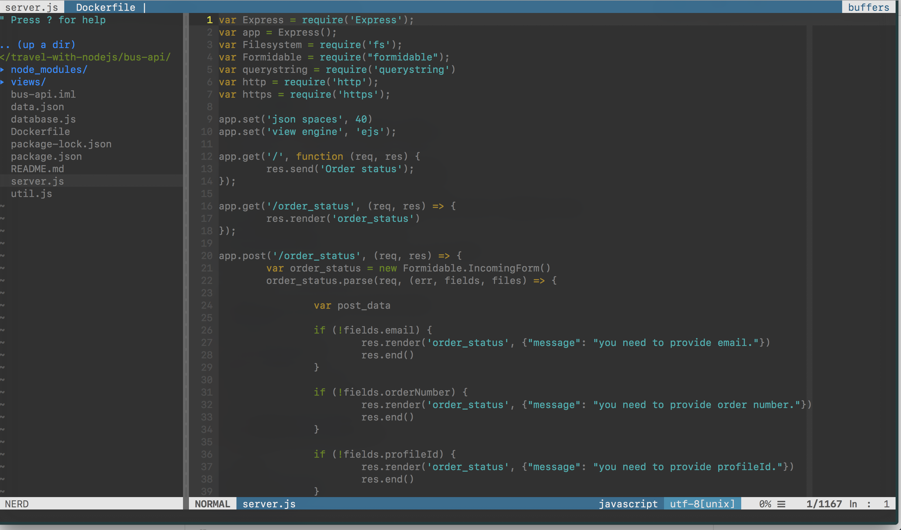

dotfiles for mac
-----------------

installation
------------

```bash
git clone https://github.com/parayaluyanta/dotfiles-mac.git
cd dotfiles-mac/

./go-on-mission.sh

# restart terminal
```

ide
---

`C-n` for explorer



previous repo
------------

https://github.com/prayagupd/dotfiles


